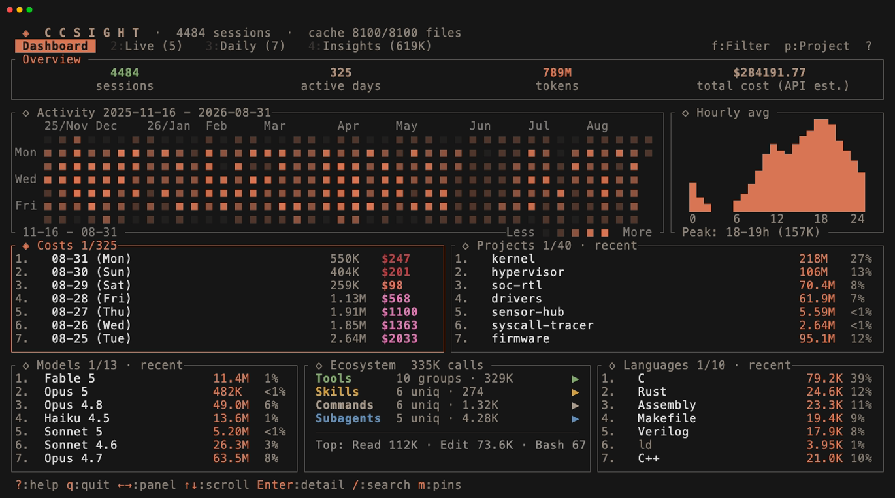
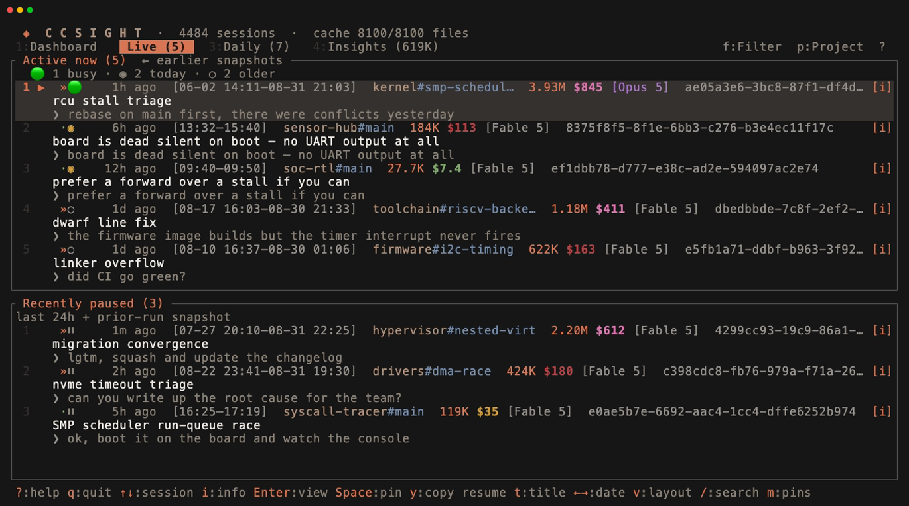
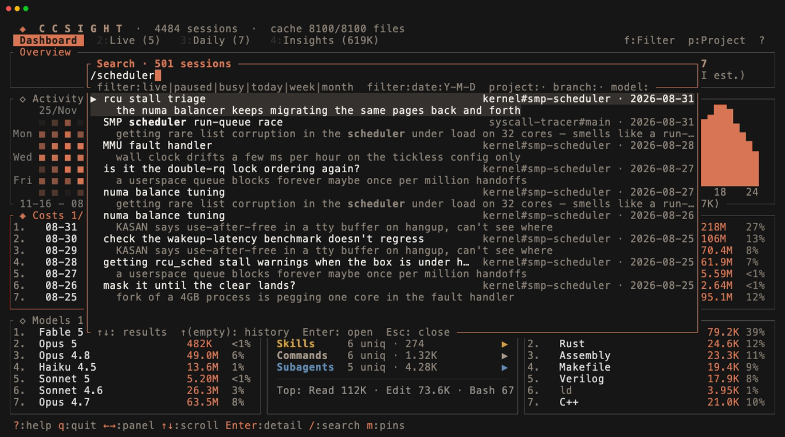
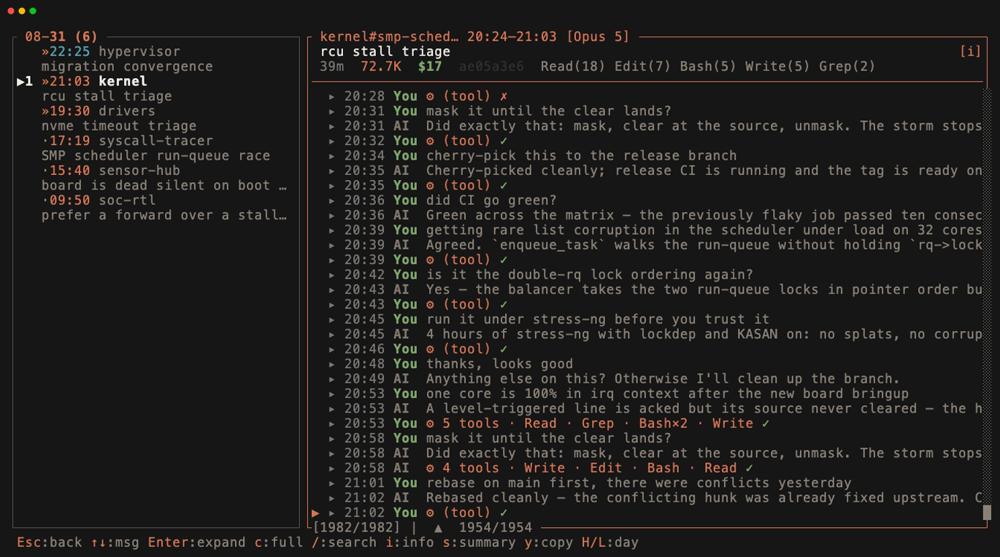
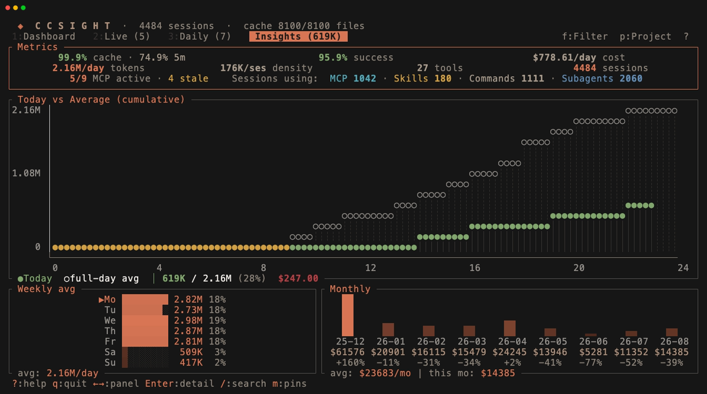
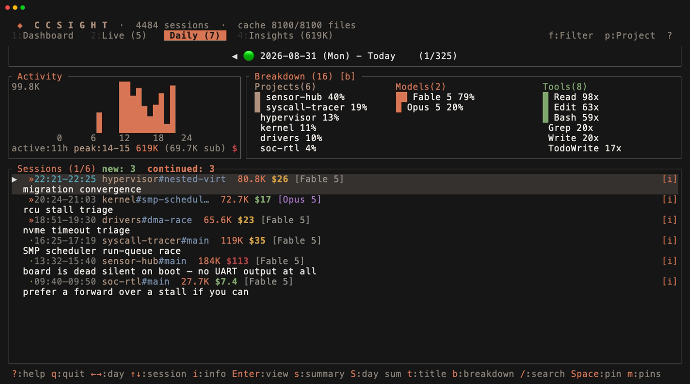

# ccsight

Claude Code session analytics in the terminal, read from your local
`~/.claude/` logs.



## Why ccsight

`/usage` and other trackers already give you cost totals. ccsight is built
around three things they don't:

- **Find & resume past work** — full-text search (tantivy) over every
  conversation, straight into the transcript viewer, then copy a ready-to-paste
  `claude -r` resume command.
- **Know when a session needs you** — the Live tab tracks busy / paused
  sessions (surviving reboots), and `--wait` blocks on one session until it
  is awaiting input, stalled, errored, exited mid-task, or ended.
- **Audit your setup** — every MCP server, skill, command, and subagent
  classified as active, stale, or installed-but-never-invoked.

Plus the usual analytics: cost with the 5m / 1h cache-write TTL split,
subagent-inclusive totals that reconcile across every view, per-project /
model / tool / language breakdowns, heatmap, hourly pattern, and weekly /
monthly trends.




<details>
<summary>More screenshots: Daily view</summary>



</details>

## Features

- **Dashboard** — cost (with 5m vs 1h cache-write TTL separated), daily / monthly trends, top projects, models, tools, languages, activity heatmap, hourly pattern
- **Live** — currently-running and recently-paused sessions, copy-resume command, post-reboot recovery via local snapshots, time-travel through past snapshots
- **Daily View** — per-day sessions + activity graph + project / model / tool breakdown + conversation viewer
- **Insights** — metrics (cost, tokens, cache, tool success, subagent overhead), today vs average, weekly / monthly trends — each with detail popups
- **Conversation** — multi-pane, syntax highlighting, in-pane search, per-turn latency / cost / token breakdown
- **Search** — full-text (tantivy) + inline filter tokens + persistent history
- **Pin** — mark sessions, reorder them, browse across dates
- **MCP Server** — `--mcp` exposes `stats`, `sessions`, `search`, `live_sessions` to other Claude clients
- **Caching** — on-disk cache + incremental full-text index for fast startup

## Installation

Pick **one** of the following:

Homebrew:

```bash
brew install esorae/tap/ccsight
```

Cargo (crates.io):

```bash
cargo install ccsight
```

From source:

```bash
cargo install --path .
```

> **macOS**: If downloading the binary directly from GitHub Releases, run `xattr -d com.apple.quarantine ccsight` to clear the Gatekeeper flag. Homebrew and `cargo install` are not affected.

## Usage

```bash
ccsight                    # Run TUI
ccsight --daily            # Print daily cost table to stdout (date / tokens / cost)
ccsight --weekly           # Same shape, aggregated by ISO week (Mon-Sun)
ccsight --monthly          # Same shape, aggregated by calendar month
ccsight --daily --json     # Any of the three as JSON ({rows, total} — jq-friendly)
ccsight --mcp              # Run as MCP server (stdio)
ccsight --wait <id>        # Block until ONE session needs you, print one line, exit
ccsight --clear-cache      # Drop the JSON cache + tantivy index, rebuild on next run
ccsight --limit 50         # Load only the 50 most recent sessions (faster startup)
```

Run `ccsight --help` for the full flag list. Press `?` in the TUI for key bindings.

### Wait (`--wait`)

Blocks until one session stops working, then prints a tab-separated line
(`state`, `session id`, `reason`) and exits 0. It polls `~/.claude` on disk —
no TUI, no hooks — so any shell command can be the notifier:

```bash
ccsight --wait 1f3a && say "agent needs you"      # id prefix is enough if unique
ccsight --wait 1f3a9c2e-4b7d-4e0a-9c66-0e2b5f8a1d34
```

States it fires on: `awaiting_input` (turn finished or tool call awaiting
approval), `stalled` (Claude owes output but is idle), `error` (unrecovered
hard error), `exited` (process died mid-task), `ended` (session is no longer
running). An unknown or ambiguous session id exits 2 with candidates on
stderr. One wait watches one session; run several for several sessions.

### Reading the numbers

Token figures labelled **work** — and the headline "tokens" totals — count
input + output only. Cache reads and writes are tracked separately: they
dominate raw volume, but the bulk of that volume is cache reads, billed at a
small fraction of the fresh-input rate. **Cost** always includes everything:
input, output, both cache-write TTLs, and cache reads. A `$?` (or trailing
`*`) marks figures involving a model with no known pricing.

### Search filters

Press `/` inside the TUI to open the search popup. Plain queries match
projects, summaries, branches, dates, and conversation content. Add any
of these tokens to narrow the result set further:

| Token | Effect |
|-------|--------|
| `filter:live` / `filter:paused` / `filter:busy` | Limit to sessions in the current Live / paused / busy poll |
| `filter:today` / `filter:week` / `filter:month` | Rolling window (local timezone): today, last 7 days, last 30 days |
| `filter:date:YYYY-MM-DD` | Exact date |
| `project:NAME` / `branch:NAME` / `model:NAME` | Substring match (case-insensitive) |

Tokens can be combined freely with each other and with free text:

```text
/filter:today project:ccsight             # today's ccsight sessions
/filter:month model:opus mcp setup        # last 30 days, Opus, containing "mcp setup"
```

The Live tab pre-fills `filter:live `, and the search popup renders recognised tokens as chips so you can confirm parsing.

## MCP Server

`ccsight --mcp` runs as a stdio MCP server exposing four tools:

- `stats` — aggregated cost / token / model metrics + per-MCP-server adoption snapshot
- `sessions` — list & detail (with `conversation_query` for in-session search)
- `search` — full-text search across all sessions (tantivy)
- `live_sessions` — currently-running and recently-disconnected sessions

The first three accept `date_from` / `date_to` (`YYYY-MM-DD`, local timezone); `live_sessions` always reports the current poll.

Register with Claude Code (user-scoped — works in every project):

```bash
claude mcp add --scope user ccsight -- ccsight --mcp
```

Other MCP hosts: add `ccsight --mcp` as a stdio server in the host's config.

## Data Source

Reads inputs from these locations:

- **`~/.claude/projects/<project>/<session>.jsonl`** — session logs (conversation
  history, tool calls, token usage). Discovered recursively at startup.
- **`~/.claude.json`** + enabled-plugin `.mcp.json` — Claude Code's MCP config.
  Used to classify each MCP server as **active**, **stale** (configured but
  idle, including never used), or **inactive** (in logs but no longer in any
  config).
- **`~/.claude/{skills,commands,agents}/`** + enabled-plugin paths — installed
  Skills / Commands / Subagents. Surfaced as zero-call rows in the Tools popup
  for entries you've installed but never invoked.
- **`~/Library/Application Support/Claude/local-agent-mode-sessions/`** *(macOS only)*
  — Claude Desktop "Cowork" sessions. The format is undocumented, so a session
  that stops parsing is skipped rather than failing the run.

State lives under `~/.ccsight/`: the parsed-session cache, the full-text
index, pins, and live-session history. `--clear-cache` removes the cache and
index; pins and live history are kept.

## License

[MIT](LICENSE-MIT) OR [Apache-2.0](LICENSE-APACHE)
